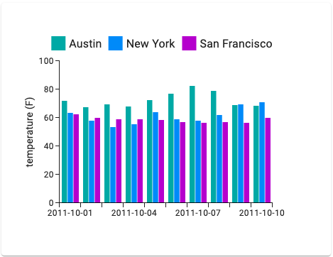

Compass Digital - Frontend Take-Home Assessment 

> Note: preview the instructions by right clicking on `README.md` and choose `Open  Preview` 

Hello, here is a fairly simple technical test to assess your skills as a frontend developer with the technologies you might use at Compass Digital.

You are being asked to render an single page in this sandbox using the following technology stack:

- TypeScript (already installed)
- React (already installed)
- React Router (v6)
- MUI / Material UI (latest version is recommended)
- [MUI X Charts](https://mui.com/x/react-charts/)
- React Testing Library (already installed)

You will need to display temperature details on a bar chart using the mock API inside the `api` folder. User will be displayed a full dataset chart like the one below:

 

  

 

Any architecture or styling decision is up to you but you should adhere to frontend best practises. You will be judged on the quality of your code, the proper functioning of the application, and any additional details you wish to add.

Your submission should include unit tests that you can run using the `npm run test` task command.

It should not take more than 2 hours to complete.

If you wish, you can complete optional bonuses / stretch goals from the following list:

- Use [data router](https://reactrouter.com/en/main/routers/picking-a-router) to prefetch your data
- Use [TanStack Query](https://tanstack.com/query/latest) for async state management

 

> How to submit?
> - Sign in and fork this sandbox by clicking on the top right `Fork` button 
> - Edit the code to make changes 
> - When you're ready to submit your code, copy and paste the link using the top right `Share` button

 

Good luck!